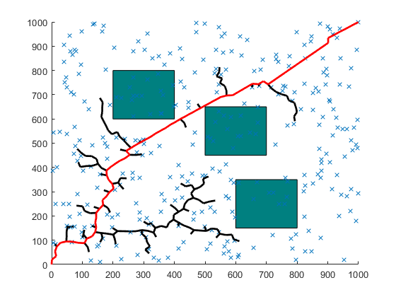
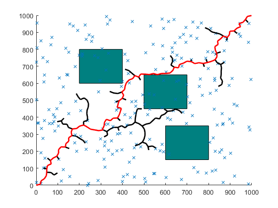

## A star

#### Algorithm Flow

1. Use the priority queue `setOpen` to store nodes awaiting expansion.
2. Continuously select nodes from `setOpen` with the lowest cost (weighted combination of current cost and heuristic function) for expansion.
3. For the selected node, calculate the path cost to its neighboring nodes and update the lowest known cost and parent node pointer for reaching each neighbor node.
4. Depending on path correction variables and the `Corner_amend` flag, path adjustments can be made to optimize the number of turns in the path.
5. Add expanded nodes to `setOpen` and update known path costs and heuristic estimates as necessary.
6. If the target node is found within the main loop, the entire path is reconstructed by backtracking from the target node to the starting node through the tracking of parent node pointers.
7. The discovered path is then visualized on a graphical interface to display the final planned path.
8. If `setOpen` is empty and the target node has not been found, the algorithm indicates that no path exists.

#### Simulation Results

## RRT star

#### Algorithm Flow

1. Pick a random node `q_rand`.
2. Find the closest node `q_near` from explored nodes to branch out from, towards `q_rand`.
3. Steer from `q_near` towards q_rand: interpolate if node is too far away, reach` q_new`. Check that obstacle is not hit.
4. Update cost of reaching `q_new` from `q_near`, treat it as `Cmin`. For now, `q_near` acts as the parent node of `q_new`.
5. From the list of 'visited' nodes, check for the nearest neighbors with a given radius, insert in a list `q_nearest`.
6. In all members of `q_nearest`, check if `q_new` can be reached from a different parent node with cost lower than `Cmin`, and without colliding  with the obstacle. Select the node that results in the least cost and update the parent of `q_new`.
7. Add `q_new` to node list.
8. Continue until maximum number of nodes is reached or goal is hit.

#### Simulation Results

We can find that the path is generally satisfactory.

## Goal-bias RRT

#### Algorithm Flow

1. Pick a random node `q_rand`, and the `q_rand` takes the target point with a probability of 0.2. The probability should between `0.05 to 0.3`. The higher the probability, the faster the search speed; the higher the probability of failing to find an existing path. This step ensures that the tree grows towards the target node.
2. Find the closest node `q_near` from explored nodes to branch out from, towards `q_rand`.
3. Steer from `q_near` towards `q_rand`: interpolate if node is too far away, reach `q_new`. Check that obstacle is not hit.
4. Add `q_new` to node list.
5. Continue until maximum number of nodes is reached or goal is hit.

#### Simulation Results

We can find that the side branches are few, but the path is not absolutely optimal.

## Path Clipping of Goal-bias RRT

#### Algorithm Flow

1. Pick a random node `q_rand`, and the `q_rand` takes the target point with a probability of 0.2. The probability should between `0.05 to 0.3`. The higher the probability, the faster the search speed; the higher the probability of failing to find an existing path. This step ensures that the tree grows towards the target node.
2. Find the closest node `q_near` from explored nodes to branch out from, towards `q_rand`.
3. Steer from `q_near` towards `q_rand`: interpolate if node is too far away, reach `q_new`. Check that obstacle is not hit.
4. Add `q_new` to node list.
5. Continue until maximum number of nodes is reached or goal is hit.
6. Search in reverse order to make sure there are no redundant paths, if so, connect the `q_end `node to its `grandparent node`.

#### Simulation Results

This is the simplest planning path.

## APFG-RRT

#### Algorithm Flow

1. Initialize `$P=P_{max}$`, `local_minima = false`.

2. Pick  a random node `q_rand`, and the `q_rand` takes the target point with a probability of `P`.

3. Find the closest node `q_near` from explored nodes to branch out from, towards `q_rand`.

4. Find the closest point on the obstacle `o_near`, which is the closest to `q_near`

5. Calculate `x_new`, the meaning of each parameter in the formula is shown in the code comments.

   * $$
     x_{new} = x_{near}+\epsilon \frac{x_{rand} - x_{near}}{d(x_{rand}, x_{near})} + \phi\frac{\boldsymbol{F}_{total}}{|\boldsymbol{F}_{total}|}
     $$

   * $$
     \boldsymbol{F}_{total} = \boldsymbol{F}_{alt}+\boldsymbol{F}_{rep}
     $$

   * $$
     \boldsymbol{F}_{alt} = F_{alt}^*\frac{q_{goal} - q_{near}}{d(q_{goal}, q_{near})} \\
     $$

   * $$
     \boldsymbol{F}_{rep} = \left\{
     \begin{array}{l}
     \frac{F_{rep}^*}{1+e^{(2|\boldsymbol{d}_{min}|/d_{rep}^*-1)k}}\frac{\boldsymbol{d}_{min}}{|\boldsymbol{d}_{min}|} & |\boldsymbol{d}_{min}| \leq d_{rep}^* \\
     0 & |\boldsymbol{d}_{min}| > d_{rep}^*
     \end{array}
     \right.
     $$

   * $$
     \boldsymbol{d}_{min} = q_{near} - o_{near}
     $$

6. Check if `q_new` and `q_rand` is hit on the obstacle. If it is not hit, add `q_new` to node list. Then judge if `x_rand` is `x_goal`, if yes, $P = P_{max}$ and let `local_minima` is false. If it is hit on the obstacle, then judge if `x_rand` is `x_goal` , if yes, let $n=0$ and `local_minima` is true. 

7. When `local_minima` is true, update probability as follows:

   * $$
     P = P_{max}(1-e^{-kn/n^*})
     $$

   * $$
     n=n+1
     $$

8. Continue until maximum number of nodes is reached or goal is hit.

#### Simulation Results

This algorithm solves the problem that the Goal-bias algorithm is prone to falling into local minima and cannot escape. You can change the parameters to observe the algorithm effect.

## RRT-Connect

#### Algorithm Flow

1. **Initialization**: Create two trees, one starting from the initial state and the other from the goal state.
2. **Expansion**: In each iteration, randomly sample a point from each tree and extend the nearest node towards the sampled point by a certain distance. This gradually expands the trees until a path between the two trees is connected.
3. **Connection**: When nodes from both trees are close enough, attempt to connect them to form a path. The connection process typically involves checking if the path avoids obstacles and performing collision detection.
4. **Iteration**: Repeat the expansion and connection steps until a feasible path from the initial state to the goal state is found, or until a predefined number of iterations is reached.
5. **Path Extraction**: If a connection between the two trees is successful, extract the path from the initial state to the goal state by tracing back through the connected nodes.

RRT-Connect is effective for high-dimensional configuration spaces and is particularly suitable for scenarios where the exact planning problem is complex and needs efficient exploration of the state space.

#### Simulation Results

