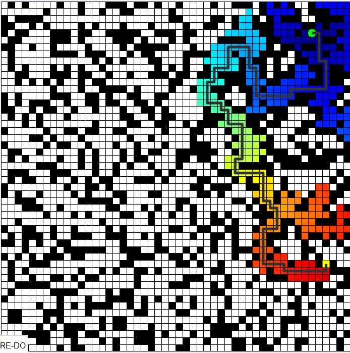

## A star

#### Algorithm Flow

1. Use the priority queue `setOpen` to store nodes awaiting expansion.
2. Continuously select nodes from `setOpen` with the lowest cost (weighted combination of current cost and heuristic function) for expansion.
3. For the selected node, calculate the path cost to its neighboring nodes and update the lowest known cost and parent node pointer for reaching each neighbor node.
4. Depending on path correction variables and the `Corner_amend` flag, path adjustments can be made to optimize the number of turns in the path.
5. Add expanded nodes to `setOpen` and update known path costs and heuristic estimates as necessary.
6. If the target node is found within the main loop, the entire path is reconstructed by backtracking from the target node to the starting node through the tracking of parent node pointers.
7. The discovered path is then visualized on a graphical interface to display the final planned path.
8. If `setOpen` is empty and the target node has not been found, the algorithm indicates that no path exists.

#### Simulation Results

## RRT star

#### Algorithm Flow

1. Pick a random node `q_rand`.
2. Find the closest node `q_near` from explored nodes to branch out from, towards `q_rand`.
3. Steer from `q_near` towards q_rand: interpolate if node is too far away, reach` q_new`. Check that obstacle is not hit.
4. Update cost of reaching `q_new` from `q_near`, treat it as `Cmin`. For now, `q_near` acts as the parent node of `q_new`.
5. From the list of 'visited' nodes, check for the nearest neighbors with a given radius, insert in a list `q_nearest`.
6. In all members of `q_nearest`, check if `q_new` can be reached from a different parent node with cost lower than `Cmin`, and without colliding  with the obstacle. Select the node that results in the least cost and update the parent of `q_new`.
7. Add `q_new` to node list.
8. Continue until maximum number of nodes is reached or goal is hit.

#### Simulation Results

We can find that the path is generally satisfactory.

## RRT based on target probability  sampling

#### Algorithm Flow

1. Pick a random node q_rand, and the q_rand takes the target point with a probability of 0.2. The probability should between 0.05 to 0.3. The higher the probability, the faster the search speed; the higher the probability of failing to find an existing path. This step ensures that the tree grows towards the target node.
2. Find the closest node q_near from explored nodes to branch out from, towards q_rand.
3. Steer from q_near towards q_rand: interpolate if node is too far away, reach q_new. Check that obstacle is not hit.
4. Add q_new to node list.
5. Continue until maximum number of nodes is reached or goal is hit.

#### Simulation Results

We can find that the side branches are few, but the path is not absolutely optimal.

## Path Clipping of RRT based on target probability  sampling

#### Algorithm Flow

1. Pick a random node q_rand, and the q_rand takes the target point with a probability of 0.2. The probability should between 0.05 to 0.3. The higher the probability, the faster the search speed; the higher the probability of failing to find an existing path. This step ensures that the tree grows towards the target node.
2. Find the closest node q_near from explored nodes to branch out from, towards q_rand.
3. Steer from q_near towards q_rand: interpolate if node is too far away, reach q_new. Check that obstacle is not hit.
4. Add q_new to node list.
5. Continue until maximum number of nodes is reached or goal is hit.
6. Search in reverse order to make sure there are no redundant paths, if so, connect the q_end node to its grandparent node.

#### Simulation Results

This is the simplest planning path.