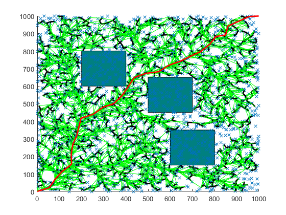
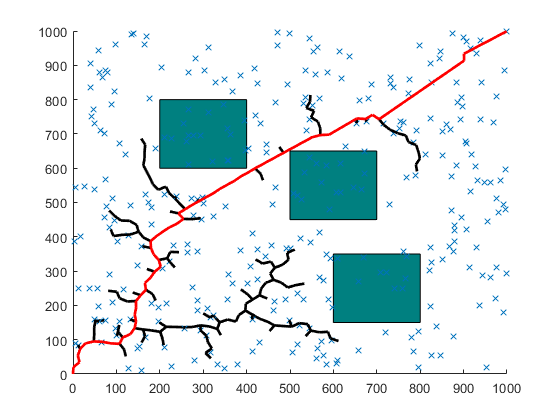
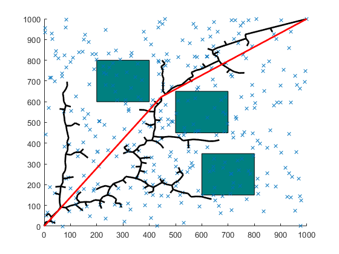

## RRT star

#### Algorithm Flow

1. Pick a random node q_rand.
2. Find the closest node q_near from explored nodes to branch out from, towards q_rand.
3. Steer from q_near towards q_rand: interpolate if node is too far away, reach q_new. Check that obstacle is not hit.
4. Update cost of reaching q_new from q_near, treat it as Cmin. For now, q_near acts as the parent node of q_new.
5. From the list of 'visited' nodes, check for the nearest neighbors with a given radius, insert in a list q_nearest.
6. In all members of q_nearest, check if q_new can be reached from a different parent node with cost lower than Cmin, and without colliding  with the obstacle. Select the node that results in the least cost and update the parent of q_new.
7. Add q_new to node list.
8. Continue until maximum number of nodes is reached or goal is hit.

#### Simulation Results

We can find that the path is generally satisfactory.

## RRT based on target probability  sampling

#### Algorithm Flow

1. Pick a random node q_rand, and the q_rand takes the target point with a probability of 0.2. The probability should between 0.05 to 0.3. The higher the probability, the faster the search speed; the higher the probability of failing to find an existing path. This step ensures that the tree grows towards the target node.
2. Find the closest node q_near from explored nodes to branch out from, towards q_rand.
3. Steer from q_near towards q_rand: interpolate if node is too far away, reach q_new. Check that obstacle is not hit.
4. Add q_new to node list.
5. Continue until maximum number of nodes is reached or goal is hit.

#### Simulation Results

We can find that the side branches are few, but the path is not absolutely optimal.

## Path Clipping of RRT based on target probability  sampling

#### Algorithm Flow

1. Pick a random node q_rand, and the q_rand takes the target point with a probability of 0.2. The probability should between 0.05 to 0.3. The higher the probability, the faster the search speed; the higher the probability of failing to find an existing path. This step ensures that the tree grows towards the target node.
2. Find the closest node q_near from explored nodes to branch out from, towards q_rand.
3. Steer from q_near towards q_rand: interpolate if node is too far away, reach q_new. Check that obstacle is not hit.
4. Add q_new to node list.
5. Continue until maximum number of nodes is reached or goal is hit.
6. Search in reverse order to make sure there are no redundant paths, if so, connect the q_end node to its grandparent node.

#### Simulation Results

This is the simplest planning path.